# Building an AI Assistant with ESP32-S3

We'll guide you through creating an AI assistant using the ESP32-S3, a microphone, and a speaker. This project will capture audio, process it with AI, and respond with synthesized speech.

## Demo


### Video Demonstration
[](https://www.youtube.com/watch?v=pYbnEi_xh0M)

## Repo:
https://github.com/lout33/ai_assistant_esp32

## Materials Needed

- ESP32-S3 Devkit
- INMP441 Microphone
- MAX98357A Amplifier
- 0.5W Speaker
- Breadboard and Jumper Wires

## Circuit Setup


1. **Connect the Microphone (INMP441):**
   - VDD to 3.3V
   - GND to GND
   - SCK to GPIO 5
   - WS to GPIO 6
   - SD to GPIO 17

2. **Connect the Amplifier (MAX98357A):**
   - VIN to 3.3V
   - GND to GND
   - BCLK to GPIO 5
   - LRC to GPIO 6
   - DIN to GPIO 7

3. **Connect the Speaker:**
   - Connect the speaker to the output terminals of the MAX98357A.

4. **Connect the Button:**
   - Connect one terminal to GPIO 35 and the other to GND.

5. **Connect the RGB LED:**
   - Connect to GPIO 48.


## Software Setup

### Arduino Code

1. **Install Required Libraries:**
   - Install `ArduinoWebsockets` and `Adafruit_NeoPixel` libraries via the Arduino Library Manager.

2. **Upload the Code:**
   - Use the provided `code.ino` file.
   - Update the WiFi credentials and WebSocket server details.

### Node.js Server

1. **Install Node.js and Required Packages:**
   ```bash
   npm install ws wav openai fluent-ffmpeg
   ```

2. **Run the Server:**
   - Use the `server.js` file.
   - Replace the OpenAI API key with your own.

### Running the Project

1. **Start the Node.js Server:**
   ```bash
   node server.js
   ```

2. **Power the ESP32-S3:**
   - Connect it to your computer or a power source.

3. **Interact with the AI Assistant:**
   - Press the button to start recording.
   - Speak into the microphone.
   - The AI will process your speech and respond through the speaker.

## Explanation

- **ESP32-S3** captures audio and sends it to the server via WebSocket.
- **Node.js Server** processes the audio using OpenAI's API and sends back a response.
- **ESP32-S3** plays the response through the speaker.

## Troubleshooting

- Ensure all connections are secure.
- Check WiFi credentials and server IP.
- Verify the OpenAI API key is correct.

This project demonstrates a simple AI assistant using readily available components. Enjoy experimenting and expanding its capabilities!


# System Architecture and Data Flow

```mermaid
graph TD
    %% Main Hardware Components
    subgraph Hardware [ESP32-S3 Hardware Components]
        Button[Push Button]
        Mic[INMP441 Microphone]
        Speaker[MAX98357A Speaker]
        LED[RGB Status LED]
    end

    %% ESP32 Processing
    subgraph ESP32 [ESP32-S3 Processing]
        AudioIn[Audio Input Handler]
        AudioOut[Audio Output Handler]
        WSClient[WebSocket Client]
        
        %% LED States
        style LED_States fill:#f9f9f9,stroke:#666
        subgraph LED_States [LED Status]
            Recording[🔴 Recording]
            Playing[🟢 Playing]
            Idle[🔵 Standby]
        end
    end

    %% Server Processing
    subgraph Server [AI Processing Server]
        WSServer[WebSocket Server]
        
        subgraph AI [OpenAI Services]
            Whisper[Speech-to-Text]
            GPT[GPT-4 Processing]
            TTS[Text-to-Speech]
        end
    end

    %% Data Flow Connections
    Button -->|Press & Hold| AudioIn
    Mic -->|I2S Protocol| AudioIn
    AudioIn -->|Raw Audio| WSClient
    WSClient -->|WebSocket| WSServer
    
    WSServer -->|Audio Stream| Whisper
    Whisper -->|Text| GPT
    GPT -->|Response| TTS
    TTS -->|Audio| WSServer
    
    WSServer -->|Audio Response| WSClient
    WSClient -->|I2S Protocol| AudioOut
    AudioOut --> Speaker

    %% LED Status Flow
    AudioIn -->|Triggers| Recording
    AudioOut -->|Triggers| Playing
    WSClient -->|Triggers| Idle
```



## System States

1. **Standby Mode** 🔵
   - System idle and ready
   - WebSocket connection active
   - LED shows blue

2. **Recording Mode** 🔴
   - Button pressed
   - Capturing audio via INMP441
   - Streaming to server
   - LED shows red

3. **Response Mode** 🟢
   - Receiving AI response
   - Playing audio via MAX98357A
   - LED shows green

## Data Processing Flow

1. **Audio Capture**
   - Button trigger → INMP441 microphone
   - I2S protocol handling
   - Raw audio buffering

2. **AI Processing**
   - Speech-to-Text (Whisper)
   - Language Processing (GPT-4)
   - Text-to-Speech Synthesis

3. **Audio Playback**
   - WebSocket streaming
   - I2S protocol output
   - Speaker amplification